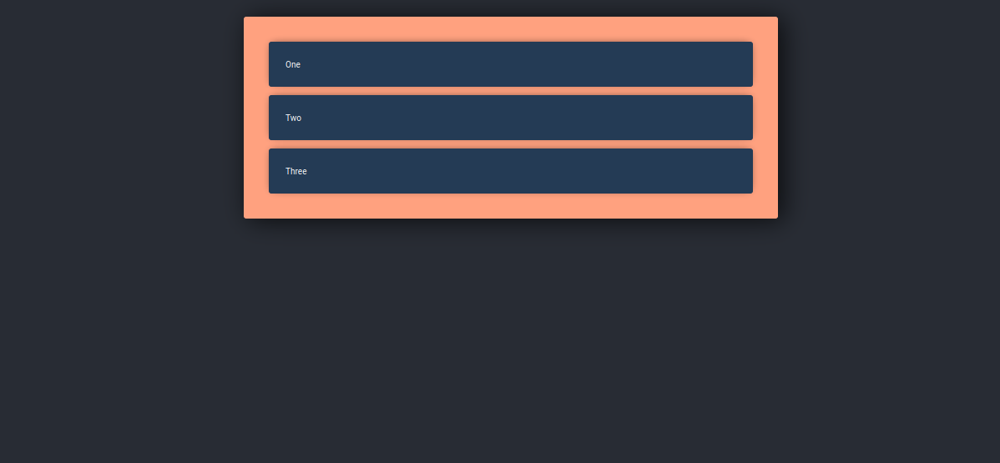

# Django with Ract 

## Simple example of how to use django with react




## It is a very simple example of how to integrate these two great technologies, creating a list of simple tasks.

# Use project 

## Recomendations

### Create virtualenv 
```bash
    python -m venv venv 
```

### Install requeriments 
```bash 
    python -m pip install -r requeriments.txt 
```

### Run project 

```bash 
    python manage.py runserver 
```

